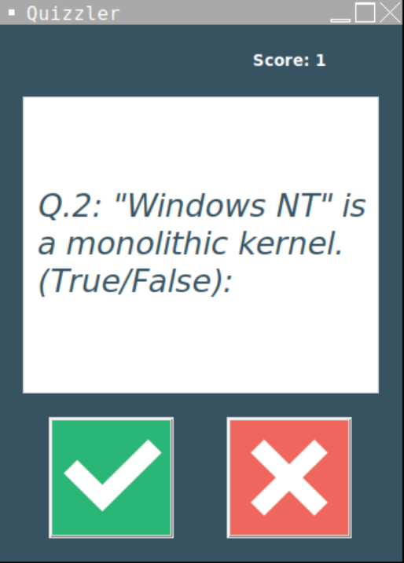

# Quiz Game

This is a simple Quiz Game built with Python and tkinter. The game fetches questions from the Open Trivia DB API and displays them to the user. The user can then answer the questions and keep track of their score. The game also has a countdown timer.

**_To play the game, simply install the packages into `requirements.txt` file and run:_**

```bash
python main.py
```

## Screenshot


